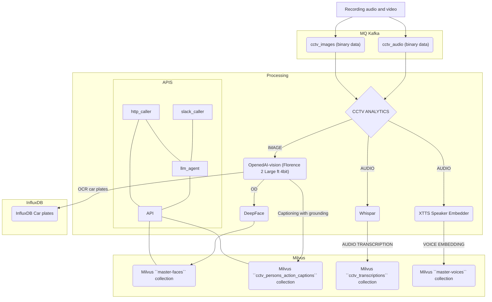

Analyze cctv image snapshots and audio chunks.
Built to integrate with your own data processing pipeline.

## Use cases
 - Detect people entering and leaving certain regions and notify about this event
 - Ask agent for summarization of cameras feeds
 - Find car registration plates

## Features
- Alerts
  - Build regions, use them for person detection and get instant notification after user enters 
- Survaillance
  - Transcript audio using Whispar API
  - Find and OCR car plates
  - Embedding voices from audio for search
  - Embedding found faces from images for search
- AI Agents
  - Get current state of all regions
    - Integration with Slack
    - HTTP API

Data Flow

## Setup
Draw regions for each camera.
- Install poetry
- Clone repository
- Install project ``poetry install``
### Setup regions
- Run ``poetry run download_images``
- Run ``poetry run draw_regions``
- For debug purposes run ``poetry run show_regions`
- Copy outputs to utils/config.json under camera key

### Setup config
- copy utils/config_example.json and rename to utils/config.json
- update config with your data setup
- run ``docker-compose up -f docker/container-compose-default.yml  -d``
- configure kafka topics
- done

## Finding simmilar faces in db
- run ``poetry run find_similar_faces <path_to_image_with_face>``

## Want to deploy with our help?
Mail us at help@motlify.com

## Special thanks to projects:
https://huggingface.co/microsoft/Florence-2-large
https://github.com/matatonic/openedai-vision
https://github.com/serengil/deepface
https://coqui.ai

